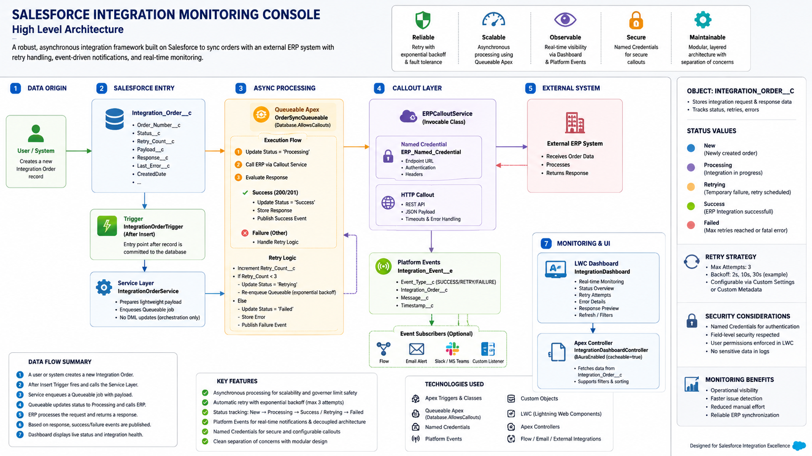
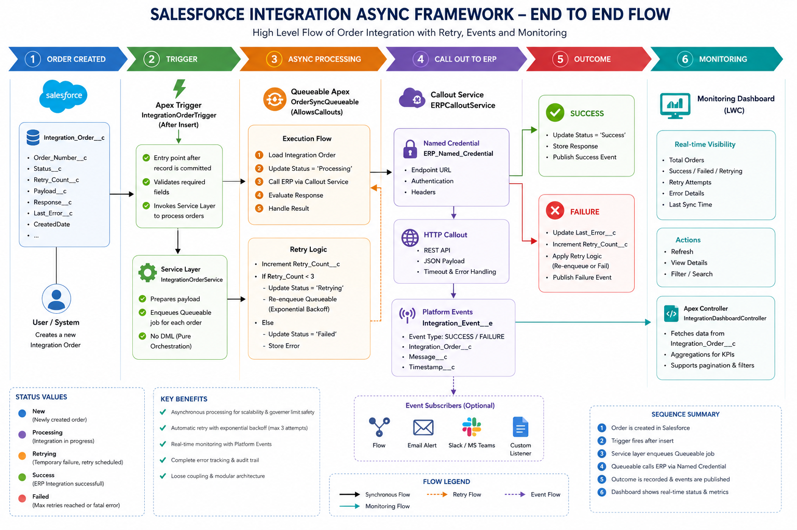
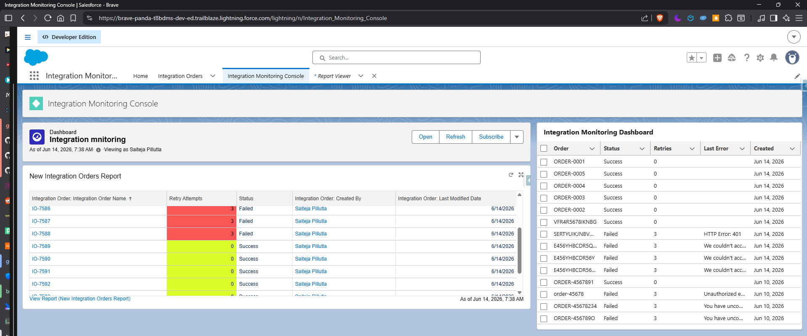

# Salesforce Integration Async Framework

Enterprise-grade Salesforce integration framework demonstrating asynchronous processing, REST API integrations, retry handling, platform events, and operational monitoring using Apex and Lightning Web Components.

---

## Overview

Organizations frequently need to synchronize Salesforce data with external ERP, Order Management, and Inventory systems.

This project simulates a real-world enterprise integration scenario where newly created orders in Salesforce are asynchronously synchronized to an external system while providing:

- Reliable asynchronous processing
- Automatic retry handling
- Error tracking and observability
- Platform Event-driven notifications
- Real-time monitoring dashboard
- Clean service-layer architecture

The goal is to showcase production-oriented Salesforce integration patterns rather than simple CRUD functionality.

---

## Business Problem

A company receives orders inside Salesforce that must be sent to an external ERP system.

Challenges include:

- External systems may be temporarily unavailable
- Network failures can occur
- Integrations should not block user transactions
- Failed requests must be retried automatically
- Support teams need visibility into processing status

This framework addresses these challenges using Salesforce-native enterprise patterns.

---

## Solution Architecture



---

## Integration Flow



---

## Monitoring Dashboard



---

## Technology Stack

### Salesforce Platform

- Apex
- Queueable Apex
- Platform Events
- Lightning Web Components (LWC)
- SOQL
- Custom Objects
- Custom Metadata Concepts
- Named Credential Ready Architecture

### Integration

- REST API
- HTTP Callouts
- JSON Serialization
- Async Processing Patterns
- Retry Framework

### Development

- Salesforce DX
- Git
- GitHub
- VS Code

---

## Architecture Components

### IntegrationOrderTrigger

Entry point of the integration process.

Responsibilities:

- Detect newly created orders
- Delegate processing to the service layer
- Maintain trigger simplicity

---

### IntegrationOrderService

Orchestration layer.

Responsibilities:

- Prepare integration payloads
- Enforce separation of concerns
- Launch asynchronous processing

---

### OrderSyncQueueable

Core processing engine.

Responsibilities:

- Execute external API callouts
- Process responses
- Handle retries
- Update integration status
- Publish monitoring events

---

### ERPCalloutService

Dedicated integration layer.

Responsibilities:

- Construct REST requests
- Serialize payloads
- Send HTTP callouts
- Return responses

---

### PlatformEventPublisher

Observability layer.

Responsibilities:

- Publish integration lifecycle events
- Enable monitoring and future subscribers
- Support event-driven architecture

---

### Integration Monitoring Dashboard (LWC)

Operations dashboard.

Responsibilities:

- Display integration status
- Surface failures
- Track retry attempts
- Provide operational visibility

---

## Data Model

### Integration_Order__c

| Field | Purpose |
|---------|---------|
| Order_Number__c | Business Order Identifier |
| Status__c | Current Processing Status |
| Retry_Count__c | Retry Attempts |
| Response__c | ERP Response Payload |
| Last_Error__c | Failure Reason |
| Payload__c | Integration Request Payload |

---

## End-to-End Processing Flow

```text
User Creates Order
        │
        ▼
IntegrationOrderTrigger
        │
        ▼
IntegrationOrderService
        │
        ▼
OrderSyncQueueable
        │
        ▼
ERPCalloutService
        │
        ▼
External ERP API
        │
 ┌──────┴──────┐
 │             │
 ▼             ▼
Success      Failure
 │             │
 ▼             ▼
Update      Retry Logic
Status          │
 │              │
 ▼              ▼
Platform Events
        │
        ▼
Monitoring Dashboard
```

---

## Retry Strategy

The framework includes automatic retry capability.

### Flow

```text
Attempt 1
   │
   ├── Success → Complete
   │
   └── Failure
          │
          ▼
       Retry #1
          │
          ▼
       Retry #2
          │
          ▼
       Retry #3
          │
          ▼
         Failed
```

### Benefits

- Improved reliability
- Reduced operational intervention
- Better fault tolerance
- More resilient integrations

---

## Key Enterprise Patterns Demonstrated

### Service Layer Pattern

Business logic separated from trigger execution.

### Asynchronous Processing

Queueable Apex used for scalable integration processing.

### Retry Pattern

Automatic retry mechanism for transient failures.

### Event-Driven Architecture

Platform Events used for integration lifecycle notifications.

### Monitoring & Observability

Dedicated dashboard for operational visibility.

### Separation of Concerns

Each class owns a single responsibility.

---

## Repository Structure

```text
salesforce-integration-async-framework
│
├── force-app/
│   ├── classes/
│   ├── lwc/
│   ├── objects/
│   └── triggers/
│
├── docs/
│   ├── architecture-diagram.png
│   ├── integration-flow.png
│   └── dashboard.png
│
├── sfdx-project.json
└── README.md
```

---

## Future Enhancements

Planned improvements:

- Named Credentials
- Custom Metadata Driven Configuration
- Dead Letter Queue Pattern
- Platform Event Subscribers
- Real-Time Dashboard Refresh
- Integration Analytics
- Bulk Processing Support
- Scheduled Retry Framework

---

## What This Project Demonstrates

This project showcases practical Salesforce engineering skills commonly required in enterprise environments:

- Apex Development
- Salesforce Integrations
- Async Processing
- Queueable Apex
- REST APIs
- Error Handling
- Monitoring Solutions
- Event-Driven Design
- LWC Development
- Solution Architecture

---

## Author

**Saiteja Pillutla**

Salesforce Developer | Apex | LWC | Integrations | Experience Cloud

GitHub:
https://github.com/saitejapillutla

LinkedIn:
https://www.linkedin.com/in/saitejapillutla

---

## License

This project is intended for learning, portfolio demonstration, and architectural reference purposes.
